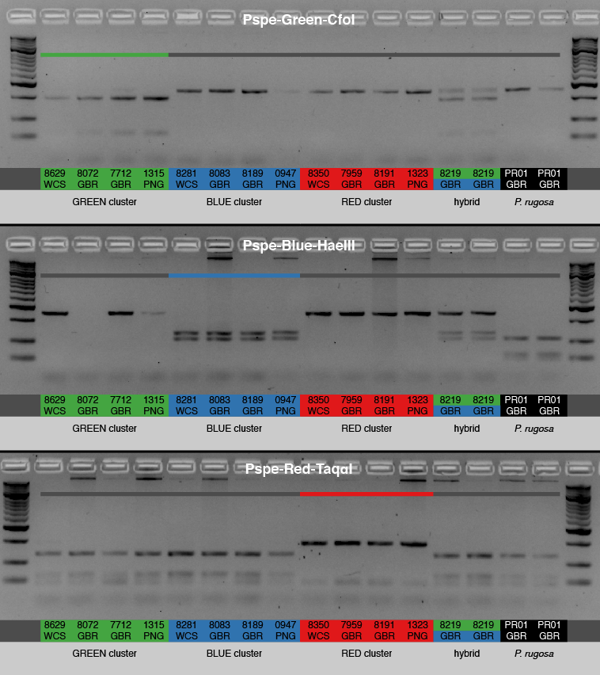
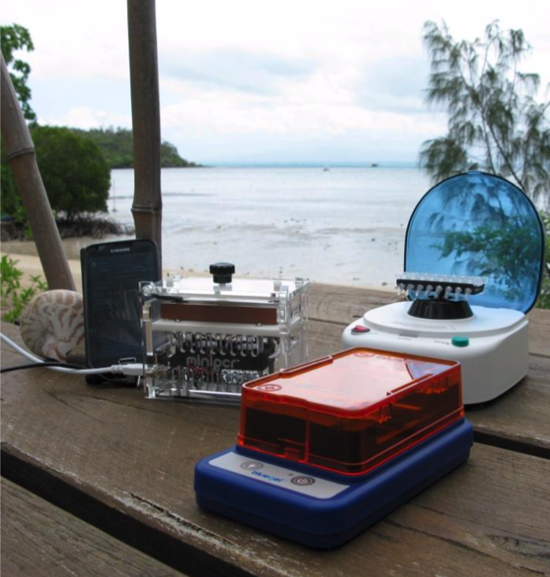

# "Morphological stasis masks ecologically divergent coral species on tropical reefs"

## D - CAPS genotyping

Details the development of cleaved amplified polymorphic sequence (CAPS) markers from the nextRAD data, and subsequent scoring of the CAPS genotyping data. *Please note that this assay was designed for samples from the Great Barrier Reef and Western Coral Sea and may not work in other regions (e.g. it did not work for samples from Okinawa)*



**Figure D1. Cleaved amplified polymorphic sequence (CAPS) used to genotype** **P. speciosa** **lineages.**  Example of diagnostic amplicons for the three different CAPS markers, using the same 15 samples. 

## D1 - CAPS marker development

Using the [pyrad_find_caps_markers.py](https://github.com/pimbongaerts/radseq/blob/master/pyrad_find_caps_markers.py) script, we screened nextRAD sequence loci (from a *de novo* analysis) for cleaved amplified polymorphic sequence (CAPS) markers. The script identifies loci that have a diagnostic mutation (distinguishing one of the lineages from the others) in the sequencing motifs of commonly available restriction enzymes (see [restrict_sites.txt](restrict_sites.txt)). It does not support ambiguities in the recognition sequence. Note that the results below are carried out with more recent files (compared to when we did the actual CAPS marker development). Also note that the pyrad `.loci` file is not filtered for symbionts or trimmed/QC-ed, and that script below were run with `| cut -f1 -d$'\t' | tr ':\n' ' '` to suppress outputting the alignments (and concatenate to a single line).

```shell
$ pyrad_find_caps_markers.py -i pachy.loci \
                             -g pachy_popfile_clusters_b3a.txt \
                             -r restriction_sites.txt \
                             -g1 GRN -m 20 \
                             -o caps_GRNvsALL
locus_35528; CfoI (GCGC) GRN (24) # ***GRN

$ pyrad_find_caps_markers.py -i pachy.loci \
                             -g pachy_popfile_clusters_b3a.txt \
                             -r restriction_sites.txt  \
                             -g1 RED -m 20 \
                             -o caps_REDvsALL
locus_9859; TaqI (TCGA) RED (27)  # ***RED
locus_54965; AluI (AGCT) RED (24)
locus_60560; TaqI (TCGA) RED (24)
locus_96999; CfoI (GCGC) RED (22)

# For the BLU cluster we lower the sample threshold here, and search for the 
# specific locus we originally identified (as `-m 20` does not yield any results)
$ pyrad_find_caps_markers.py -i pachy.loci \
                             -g pachy_popfile_clusters_stringent_b3a.txt \
                             -r restriction_sites.txt  \
                             -g1 BLU -m 5 -o caps_BLUvsALLmin5 \
    | grep "locus_61521" -A 5
locus_61521; HaeIII (GGCC) BLU (6)  # ***BLU
```

Create a fasta file with the first sequence for each of the three target loci. Note that more loci were tested, but only the eventual loci are included here for demonstrative purposes. Then, map the target loci back to the reference genome (this was originally done with a short-read draft genome assembly), retrieve the scaffold names corresponding to the target loci, and extract scaffold sequences from genome assembly and add to fasta with target locus sequences:

```shell
$ cat <(head -2 caps_GRNvsALL/locus_35528.fa) \
      <(head -2 caps_REDvsALL/locus_9859.fa) \
      <(head -2 caps_BLUvsALLmin5/locus_61521.fa) \
      | sed 's/-//g' > target_loci.fa
# bwa index pspe_final_0.11.fasta # (only if genome not already indexed)
$ bwa mem pspe_final_0.11.fasta target_loci.fa > target_loci.sam
$ grep -v @ target_loci.sam | cut -f1-4
GRN_PSCFSA0445;	16	Sc0000400	696209 # match 696242
RED_PSCFXH0658;	16	Sc0001682	71559
BLU_PSCBDH8287;	16	Sc0000669	3977288 #8 = closest: 400156
$ cp target_loci.fa target_loci_scaffold.fa
$ for i in Sc0001682 Sc0000400 Sc0000669; do 
      sed -n "/>$i/,/>/ p" $GENOME_REF_PATH/pspe_final_0.12.fasta \
          | sed '$d' >> target_loci_scaffold.fa; \
  done
```

We then aligned target loci and matching genome scaffolds using a GUI (e.g. [Codoncode Aligner](https://codoncode.org/) or [Geneious](https://www.geneious.com/)) and extracted a region ~200-400 bp upstream and downstream of the target locus. We also mapped the Illumina HiSeq data from several whole-genome resequencing samples to identify SNPs that need to be avoided in the primer design. We then used this information to design primers using the [Primer3](http://primer3.ut.ee) portal, with the diagnostic restriction site highlighted as "target" (using brackets).

Once the annotated genome was finalized, we assessed whether the CAPS target regions occur in annotated gene regions:

```shell
$ grep Sc0000400 pspe_0.12.maker_post_002.genes.gff3 | awk '$4<696209 && $5>696209'
Sc0000400	maker	gene	680247	700073	.	+	.	ID=pspe_0.1.m1.40518;Name=pspe_0.1.m1.40518
Sc0000400	maker	mRNA	680247	700073	.	+	.	ID=pspe_0.1.m1.40518.m1;Name=pspe_0.1.m1.40518.m1;Parent=pspe_0.1.m1.40518
$ grep 40518 pachy_gene2uniprot_b4c.txt | head -1
pspe_0.1.m1.40518	B4F6V6 # Pre-B-cell leukemia transcription factor 1
$ grep Sc0001682 pspe_0.12.maker_post_002.genes.gff3 | awk '$4<71559 && $5>71559'
# no matches with annotated regions
$ grep Sc0000669 pspe_0.12.maker_post_002.genes.gff3 | awk '$4<3977288 && $5>3977288'
# no matches with annotated regions
```

Below the table of the eventual primer/RE combinations:

| Primer name          | Primer sequences         | Enzyme    | Digest: no  | Digest: yes |
| -------------------- | ------------------------ | --------- | ----------- | ----------- |
| Pspe-Green-CfoI/HhaI | F: ACCTGGTGACCTTTGCCATA  | CfoI/HhaI | not “green” | “green”     |
|                      | R: TCTGTCAGTAGAGGGAGGGG  |           |             |             |
| Pspe-Blue-HaeIII     | F:  CCGTTTCTTCGTCAGCCATT | HaeIII    | not “blue”  | “blue”      |
|                      | R: CACATCGCTCTTCTTCCGTT  |           |             |             |
| Pspe-Red-Taqα1       | F: TAATCGCACTGCTAGGGACG  | Taqα1     | “red”       | not “red"   |
|                      | R: CTTGGTCTGTTTGTAGCCGT  |           |             |             |

## D2 - CAPS Genotyping

Merged CAPS and nextRAD genotypes are listed in the [pachy_genotypes.csv](pachy_genotypes.csv) file with the "final_assignment" field used in figures and analyses. The following rules were used in scoring/merging the data:

* For the CAPS assignment, at least one positive match (one marker; e.g. "RED" was scored as "RED") or two negative matches (two markers; "NON-BLUE" and "NON-RED" was scored as "GREEN") were required for lineage assignment. Mixed banding patterns could reflect either incomplete digestion  by the restriction enzyme or hybrid individuals, however here they were always scored as "incomplete digestion". Samples with conflicting assignments (e.g. "GREEN" and "BLUE") were removed (n = 8 including the F1 `PSGRB_8219` hybrid).
* For the nextRAD assignment, the assignments were based on the "lenient" 0.8 ancestry coefficient cut-off (file:`pachy_popfile_clusters_b3c.txt`; k = 6). "UNASSIGNED" samples were removed, unless they showed mixed ancestry between the two "blue" or between the two "green" clusters (and this added up to 0.8; this only applied to PNG and OKI samples) - and if so they were manually renamed:

```shell
$ grep -Ff <(grep UNA pachy_popfile_clusters_b3c.txt | cut -f1) \
					 pachy_structure_k6_b3c.csv \
		> pachy_structure_k6_lenient_admixed_b4d.csv
# Order of columns: #3="RED", 4="BL2", 5="BLU", 6="ISR", 7="GR2", 8="GRN"
$ echo "Pop\tSample\tRed\tBlue\tGrn"; \
  awk -F',' '{print $1 "\t" $2 "\t" $3 "\t" $4+$5 "\t" $7+$8}' \
      pachy_structure_k6_lenient_admixed_b4d.csv | awk '$3>0.8 || $4>0.8 || $5>0.8'
Pop	Sample			Red			Blue		Grn
OKD	PSOKDH7058	0.0001	0.9972	0.0022	# BLU
OSS	PSOSSH7170	0				0.9871	0.0023	# BLU
OSS	PSOSSH7174	0.0189	0.9789	0.0014	# BLU
OSS	PSOSSX7184	0.0001	0.9966	0.0021	# BLU
PGS	PSPGSH1095	0.0011	0.9929	0.0055	# BLU
PGS	PSPGSH1105	0.0019	0.0093	0.9648	# GRN
PVD	PSPVDH1223	0.0001	0.9979	0.0019	# BLU
PVD	PSPVDH1235	0.0022	0.9589	0.0364	# BLU
PVD	PSPVDH1245	0.0001	0.9913	0.0079	# BLU
PVD	PSPVDH1249	0				0.9979	0.0009	# BLU
PVD	PSPVDH1267	0.0001	0.9986	0.0009	# BLU
PVS	PSPVSH1297	0.0006	0.0125	0.969		# GRN
PVS	PSPVSH1317	0.0018	0.0047	0.98		# GRN
PVS	PSPVSH1340	0.0121	0.0364	0.9473	# GRN
PVS	PSPVSH1353	0.0001	0.9975	0.0023	# BLU
```

Three conflicting results  between CAPS and nextRAD assignments (out of 120 samples) were found and removed, with all three samples coming from PNG:`PSPVS_1317` and `PSPVS_1340` ("RED" for CAPS and "GREEN/DARK-GREEN" for nextRAD), and `PSPGS_1059` ("BLU" for CAPS and "GREEN" for nextRAD).

```shell
$ grep -v 'study_code' pachy_genotypes.csv| wc -l
1442 # Total number of samples with assignments (after filtering)
$ grep -v 'study_code' pachy_genotypes.csv | awk -F',' '$3!=""' | wc -l
452 # Number of included nextRAD assignments
$ grep -v 'study_code' pachy_genotypes.csv | awk -F',' '$4!=""' | wc -l
1119 # Number of CAPS assignments
$ grep -vE 'study_code|UGB|UGR|UBR' pachy_genotypes.csv | awk -F',' '$3!="" && $4!=""' | wc -l
117 # Number with both resolved CAPS and RADseq genotype (note that 3 conflicting were removed)
```

Summary of sample sizes by region (`C`, `G`, `D`) and habitat (`B`, `S`, `D`, `X`):

```shell
$ grep -v 'study_code' pachy_genotypes.csv | awk '{print substr($1,3,1) substr($1,5,1)}' | sort | uniq -c | sort -rn
 320 CD
 315 GD
 204 GB
 168 CS
 141 GS
  68 PD
  64 PS
  58 CX
  31 CM
  22 OD
  20 RD
  17 GM
  12 OS
   1 HP
   1 GX
```



**Figure D2 Field-based genotyping.**  Field-based genotyping set-up as used for the identification of spawning corals at Orpheus Island on the Great Barrier Reef (Photo by Dagmar Wels).